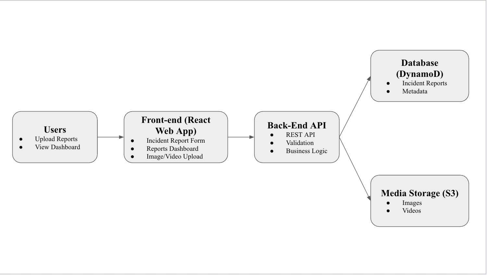

# Theft Tracker Echo

A lightweight incident tracking service built with Flask, SQLAlchemy, Redis, and RQ.  
This project demonstrates production monitoring, data analysis, background job processing, and continuous delivery.

---

## Architecture Overview

This project is a simple incident tracking service with synchronous request handling and optional asynchronous enrichment.

### Components

- **Flask Web App (`app.py`)**
  - Web UI for submitting incidents and viewing a dashboard
  - REST-style endpoints for analysis and monitoring
- **Database (SQLAlchemy)**
  - Persists incidents and enrichment fields
  - Uses SQLite locally, Postgres in production (via `DATABASE_URL`)
- **Background Jobs (Redis + RQ)**
  - When an incident is created, the app can enqueue an enrichment job (`tasks.py`)
  - A worker (`worker.py`) consumes jobs and updates the incident with enrichment results

### Request / Data Flow

1. User submits an incident via the web form (`POST /incidents`)
2. App writes the incident to the database
3. App _optionally_ enqueues a background enrichment job (if `REDIS_URL` is configured)
4. Worker processes the job and updates the incident record
5. Dashboard (`GET /incidents`) and details (`GET /incidents/<id>`) display the latest incident status

### Architecture Diagram

A high-level diagram is included in the project slides (Google Slides) and shows the main components and data flow.



## Production Monitoring

This application exposes monitoring endpoints suitable for production environments.

### Health Check

**GET /health**

- Verifies database connectivity
- Returns HTTP 200 if the application is healthy

### Metrics

**GET /metrics**

Returns basic operational metrics:

- `uptime_seconds`
- `total_requests`
- `requests_per_second`
- `incidents_created`

These endpoints support observability and production monitoring.

---

## Data Analysis

The application provides a simple data analysis endpoint.

### Incident Analysis

**GET /analysis**

- Returns the total number of incidents
- Groups incidents by category

Example response:

```json
{
  "total_incidents": 5,
  "by_category": {
    "theft": 3,
    "other": 2
  }
}
```

This endpoint is validated using unit tests with mocked database queries.

---

## Background Processing

Incident enrichment is handled asynchronously using Redis and RQ.

- Incident creation publishes a background job
- A worker processes enrichment without blocking requests
- This decouples request handling from external API calls

---

## Continuous Integration & Delivery

This project uses CI/CD:

- GitHub Actions runs the full test suite on every push
- Tests must pass before deployment
- Render automatically deploys the `main` branch
- No manual deployment steps are required

This implements continuous integration and continuous delivery.

---

## Running Locally

### Setup

```bash
python3 -m venv .venv
source .venv/bin/activate
python3 -m pip install -r requirements.txt
```

### Run the Application

```bash
python3 app.py
```

Open in your browser:

```
http://127.0.0.1:8000/
```

---

## Running Tests

```bash
python3 -m pytest -q
```

All tests should pass locally and in CI.
